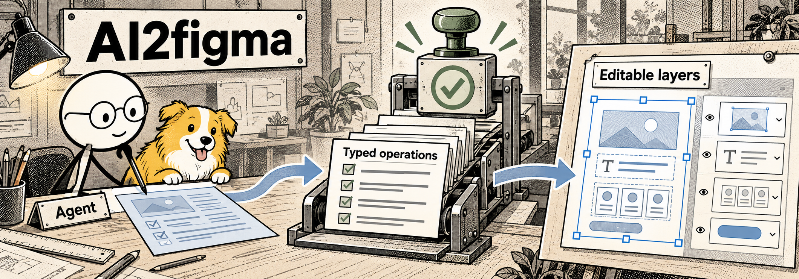
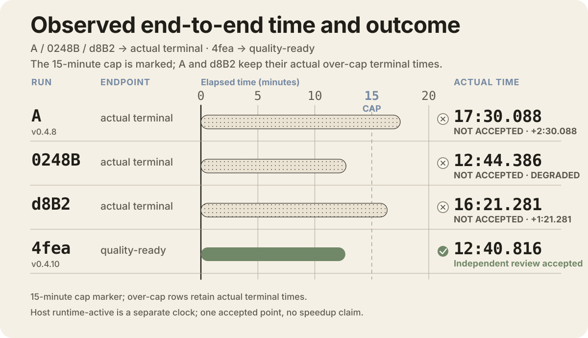
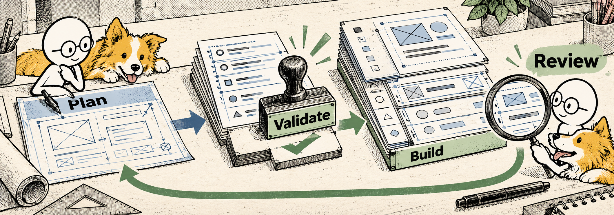
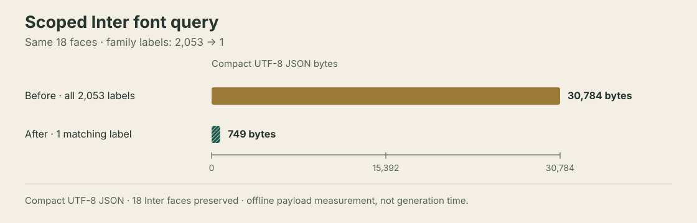

# AI2figma
English | [简体中文](README.zh-CN.md)

**An AI agent can build or update a Figma page; AI2figma applies the changes as editable layers and records the result.**

v0.4.10 · Default host mode needs no provider API key.

  

<em>Conceptual illustration, not a product screenshot.</em>

AI2figma is a local runtime for Figma Desktop. It connects an AI host to Figma locally, checks each structured write before applying it, and records the result. The public repository contains product documentation and evaluation information; source code is private.

## Current stage · Oct 8, 2026

No-reference `workflow="greenfield"` development is paused after this stage closeout; the existing implementation and evidence are retained. Active work defaults to Existing edits and new pages built from an actual supplied reference. The code checkpoint remains private; this documentation update does not publish source or create a new feature version.

| Checkpoint | Local verification | Native fixture status |
| --- | --- | --- |
| `08ef304` | Official plain `npm run verify`: 3,201 tests, 3,197 passed, 4 skipped, 0 failed, 454 suites; guard, TypeScript build, and plugin build passed. | Root returned `SCOPED_NATIVE_PASS`; the Host run remains `REVIEW_REQUIRED`, not complete. The fixture has no timing result. |
| First reference-led batch · `8eb298a5bc7e517d277f0da280225439c6e1b0a2` | Official plain local `npm run verify` (2026-10-08): 3,222 tests, 3,218 passed, 4 skipped, 0 failed, 456 suites; 404,787.1937 ms. | Native remains `DECOMPOSITION_REQUIRED`; no Figma drawing, Native PASS, or new timing is claimed. |

These are local verification records, not GitHub CI results. The passive-preload diagnostic ran tests only and is not equivalent to the full plain gate. The official plain runs used no preload or `NODE_OPTIONS`. The formal version remains v0.4.10; this is a main-branch maintenance batch, not a new release.

The reference CLI entry is `fdr host start "<request>" --references-file <json>`. This batch makes three scoped changes:

- On one controlled Existing fixture with the same call and query, Bridge RPCs fell from 9 to 6. This is a call-count result, not an end-to-end speed measurement.
- Dense-text row placement is more reliable; unmatched or multiline text keeps its original geometry.
- For screenshot input, the host agent selects a complete viewport and preserves the original while recording any crop. The new helper is a PNG preprocessing step; Host retains its existing support for other image formats. A clear, complete artboard needs no user-made clean export; whole-image no-op preserves the PNG bytes, exact replay adds zero writes, and ambiguous or clipped candidates remain unresolved rather than guessed.

See the [scoped batch details](METRICS.md#first-reference-batch-oct-8).

## Historical v0.4.10 native timing

Four historical native-entry observations

  

The v0.4.10 sample was a 1440×900 page with no image nodes. Its contemporaneous readback returned 91 native nodes, but was depth-limited; a complete Oct 7 readback found 112 nodes, including 21 existing descendants omitted below three cutoff parents. See the [readback correction](METRICS.md#native-readback-correction-oct-7). The independent review accepted five checks: required information, budget focus, readability, table alignment, and editable elements. One non-blocking visual-balance suggestion remains.

| Native observation | Time (m:s) | Recorded outcome |
| --- | ---: | --- |
| Early run · v0.4.8 | `17:30.088` | Review was still required after the 15-minute cap |
| Intermediate run · candidate 0248 | `12:44.386` | The run finished, but review required rework; timing coverage was incomplete |
| Canonical d8 run | `16:21.281` | Review was still required after the 15-minute cap; later visual closure did not change the timing record |
| v0.4.10 production source | `12:40.816` | Independent review accepted; timing record is valid |

The first three observations end at their recorded terminal outcomes; the last ends after quality readiness and review. These are not an accepted old/new comparison. We report one accepted timing point, not a speedup or a median.

## Active workflows

| Workflow | Starting point | Result |
| --- | --- | --- |
| Update a page | An existing Figma page and a requested change | A scoped edit with before/after evidence and rollback protection |
| Rebuild a reference | A local image or supplied Figma material | A measured plan that reconstructs supported regions as editable layers |

Legacy / paused no-reference Greenfield

The legacy `workflow="greenfield"` path creates a page from a brief without a reference. Its development is paused; existing code and records are retained. New pages based on a real supplied reference remain active.

## How the local runtime works

  

<em>Conceptual illustration of the workflow, not a product screenshot.</em>

An agent proposes a change. The local runtime checks the structured operations, applies them through the Figma plugin, then reads the document back and records evidence. Typed operations, transaction tracking, locks, rollback support, and readback evidence help control writes; unresolved outcomes fail closed instead of being retried automatically.

The runtime owns validation and document operations; the AI host owns planning. The default mode uses the AI host for reasoning and needs no provider API key; optional provider modes are configured separately. No model runs arbitrary JavaScript inside Figma.

On current source main, the standard stdio MCP server starts or reuses the local Bridge when the first runtime-backed tool is called. MCP initialization, tool discovery, and static workflow guides do not start it. In Figma Desktop, import and run the plugin through the normal Development plugin flow; Bridge health does not mean the plugin is connected. The host does not open the plugin or switch files, and it closes only the Bridge instance it created.

A run record connects the requested scope to its operations, final tree, review state, and integrity hashes. Recorded transactions include rollback support; uncertain writes are checked against Figma state and fail closed instead of being retried silently.

## v0.4.10 release checks

| Check | Result |
| --- | --- |
| v0.4.10 source snapshot | 414 source commits; 538 TypeScript/TSX files; 251,916 LF-delimited physical lines (repository size, not a quality measure) |
| Canonical production-source verification | 3,105 tests; 3,104 passed, 1 skipped, 0 failed across 453 suites |
| Private mirror main CI | 3,099 tests; 3,083 passed, 16 skipped, 0 failed across 453 suites · [run 37460767274](https://github.com/Nixz0824/AI2figma-source/actions/runs/37460767274) |
| Private mirror v0.4.10 tag CI | 3,099 tests; 3,083 passed, 16 skipped, 0 failed across 453 suites · [run 37460770403](https://github.com/Nixz0824/AI2figma-source/actions/runs/37460770403) |

The release tag includes the verified 4fea production source plus a documentation record. One non-blocking layout-balance suggestion remains. Independent review is not user sign-off. These checks describe this page and release pipeline; they do not claim pixel equivalence or quality across every design.

The `08ef304` checkpoint retains the no-reference Greenfield implementation as a legacy path; development is paused. Existing edits and reference-led new pages remain in scope. This does not claim every reference route is complete or optimized. See the [Oct 8 stage records](METRICS.md#stage-closeout-oct-8).

The earlier bounded mobile/Existing review at `f4414ef` had a local verification result of 3,178 tests (3,177 passed, 1 skipped, 0 failed). Root gave limited fixture acceptance for mobile fit, scoped placement, and one Existing text edit; owned-root cleanup is verified. This is historical scoped evidence, not the current gate total; see the [detailed review](METRICS.md#current-main-mobile-existing-oct-7).

The current-main font-query fix preserves all 18 Inter faces while reducing the offline compact UTF-8 response from 30,784 to 749 bytes (97.57%); see the [measurement details](METRICS.md#current-main-font-payload-oct-7).

  

An Oct 7 E2E timing attempt that predates this fix was rejected by automatic review before Host (`PRE_HOST_REQUEST_BLOCKED`), producing no design or accepted timing. Its 115,803 ms pre-Host window is an incomplete observation and is not counted as generation timing.

Source commit `6576101` checks content, style, and geometry around Existing edits, and binds its undo to the expected transaction ID. At production HEAD `657610181b1d1587fe7556c989c6b42d1a2a4a55`, `npm run verify` passed 3,190 tests across 454 suites (3,189 passed, 1 skipped, 0 failed); guard, TypeScript build, and plugin build passed. The captures do not exclude user edits atomically. The connected plugin still uses the Oct 6 bundle, so this source wave has no native acceptance yet; an updated bundle is required. See [current source and deployment limits](METRICS.md#current-main-existing-integrity-oct-7).

## Plan the first evaluation

Once access is provided, start with a small, reviewable task:

1. State the goal, target viewport, and information that must remain visible.
2. In Figma, inspect the text, tables, and charts as editable native layers.
3. Review the resulting page and its evidence before expanding the scope.

## Request an evaluation

The source is private. Personal, non-commercial evaluation is free; an official build may be provided on request. To start, [open an evaluation issue](https://github.com/Nixz0824/AI2figma/issues/new) with your operating system, Figma Desktop setup, and the workflow you want to evaluate. Do not include credentials or private design files in a public issue.

## License and boundaries

Commercial use requires a separate written license. Source code is not distributed, and the license prohibits redistribution and using the materials or outputs to train models. Read the [evaluation license](LICENSE) before requesting a build.

Reference inputs must be local; URL references are not supported. Photos, icons, and external components must be supplied manually. Reference adaptation uses a separate completion policy; completion under that policy does not mean strict fidelity passed.

The timing example uses a bounded synthetic-data task. The page is a single reviewed sample, not a user screenshot, benchmark average, pixel-perfect reconstruction claim, or promise that every design will pass the same checks.

## More detail

- [Metrics, historical runs, and evidence references](METRICS.md)
- [Generation timing observation (Oct 8, 2026)](docs/GENERATION_TIMING_2026-10-08.md)
- [Scoped native handoff (Oct 8, 2026)](docs/GREENFIELD_NATIVE_HANDOFF_2026-10-08.md)
- [Greenfield pause and stage archive (Oct 8, 2026)](docs/GREENFIELD_PAUSE_2026-10-08.md)
- [中文说明](README.zh-CN.md)
- [Architecture overview (English)](ARCHITECTURE.md)
- [System map (SVG)](assets/readme/architecture-en.svg)
- [Workflow diagram (SVG)](assets/readme/workflow-en.svg)
- [Evaluation license](LICENSE)
