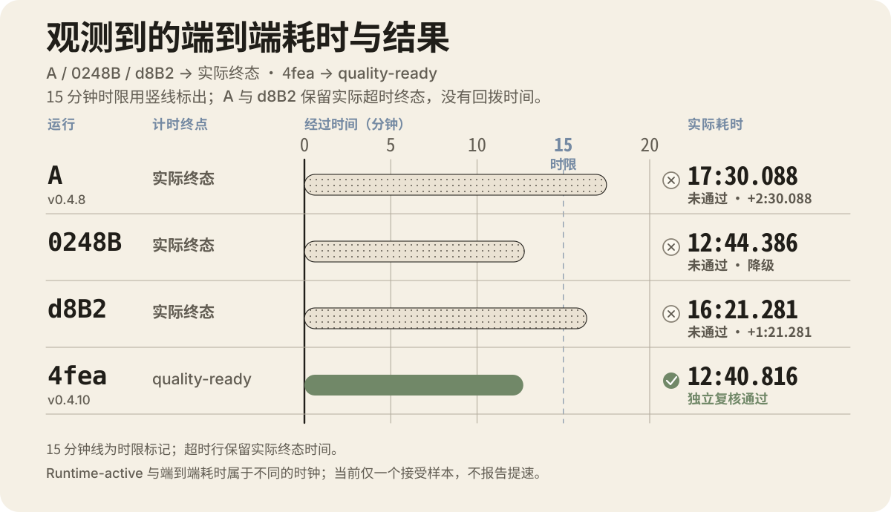
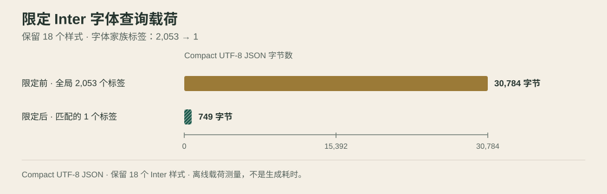

# AI2figma
简体中文 | [English](README.md)

**AI 智能体可在 Figma 页面上创建或修改内容；AI2figma 将改动写成可编辑图层，并记录结果。**

v0.4.10 · 默认由 AI 宿主负责推理，无需 provider API key。

  

<em>机制示意图，不是产品截图。</em>

AI2figma 是面向 Figma Desktop 的本地运行时。它在本机连接 AI 宿主与 Figma，对每次结构化写入先校验，再记录结果。公开仓库提供产品文档和评估信息；源码保持私有。

## 当前阶段 · 2026-10-08

无参考 `workflow="greenfield"` 开发在本阶段收尾后暂停；现有实现与证据保留。未来工作默认面向 Existing 编辑和基于用户真实参考的新页面。源码检查点保持私有；本次文档更新不发布源码，也不创建新功能版本。

| 检查点 | 本地验证 | 原生 fixture 状态 |
| --- | --- | --- |
| `08ef304` | 官方 plain `npm run verify`：3,201 项测试、3,197 通过、4 跳过、0 失败，共 454 个套件；guard、TypeScript build 和 plugin build 均通过。 | Root 给出 `SCOPED_NATIVE_PASS`；对应 Host 运行仍为 `REVIEW_REQUIRED`，尚未完成。该 fixture 没有计时结果。 |
| 首批有参考优化 · 测试检查点 `0b3fccd`（生产源码仍为 `8eb298a`） | 2026-10-09 官方 plain 本地 `npm run verify`：3,222 项测试、3,218 通过、4 跳过、0 失败，共 456 个套件。 | 原生状态仍为 `DECOMPOSITION_REQUIRED`；没有在 Figma 绘制，没有 Native PASS 或新计时。 |

以上均为本地验证记录，不是 GitHub CI 结果。passive-preload 诊断只运行了测试，不等同全量 plain gate。官方 plain run 均未使用 preload 或 `NODE_OPTIONS`。正式版本仍是 v0.4.10；这是 main 分支维护批次，不是新版本发布。

参考输入的 CLI 入口为 `fdr host start "<request>" --references-file <json>`。本批有三项有界改进：

- 在调用与查询相同的一个受控 Existing fixture 中，Bridge RPC 数从 9 次降至 6 次。这是调用数结果，不是端到端提速测量。
- 密集文字行定位更稳；未匹配和多行文字保留原有几何。
- 对截图输入，host agent 会选择完整 viewport，保留原图并记录裁切。新增 helper 是 PNG 预处理步骤；Host 对其他图片格式仍保留原有支持。画板完整且清楚时，用户无需另做干净导出；整图 no-op 保留 PNG 字节，相同输入重跑新增写入为 0；候选不明确或被截断时不会猜测。

详见[范围内批次说明](METRICS.zh-CN.md#first-reference-batch-oct-8)。

## v0.4.10 历史原生计时

四次历史原生入口观测

  

v0.4.10 样例是 1440×900 页面，没有图片节点。当时的读回返回 91 个原生节点，但受深度限制；10 月 7 日完整读回为 112 个节点，其中 21 个既有后代此前因三个截断父节点而未返回。详见[读回更正](METRICS.zh-CN.md#native-readback-correction-2026-10-07)。独立审查接受了五项检查：信息完整、预算重点、可读性、表格对齐和图层可编辑。页面仍保留一项非阻塞的视觉平衡建议。

| 原生样例 | 用时（分:秒） | 记录结果 |
| --- | ---: | --- |
| 早期运行 · v0.4.8 | `17:30.088` | 超过 15 分钟上限后仍需复核 |
| 中间样例 · candidate 0248 | `12:44.386` | 系统结束后仍需返工；阶段计时覆盖不完整 |
| canonical d8 样例 | `16:21.281` | 超过 15 分钟上限后仍需复核；之后的视觉收尾不改写计时记录 |
| v0.4.10 生产源码 | `12:40.816` | 独立审查接受；计时记录有效 |

前三次的终点是各自记录的终态；最后一次则计至质量就绪并完成审查。这些数据不构成已验收的旧版与新版性能对照。我们只报告一个已验收的计时点，不计算提速比例或中位数。

## 当前工作流

| 工作流 | 输入 | 输出 |
| --- | --- | --- |
| 修改页面 | 已有 Figma 页面与改动要求 | 有明确范围的修改、前后证据和回滚保护 |
| 按参考重建 | 本地图片或用户提供的 Figma 材料 | 测量后的计划，并将支持的区域重建为可编辑图层 |

Legacy / Paused：无参考 Greenfield

Legacy `workflow="greenfield"` 在没有参考时根据 brief 创建页面。该路径暂停开发；现有代码和记录保留。基于用户真实参考的新页面仍在范围内。

## 本地运行时如何工作

  

<em>本地工作流机制示意图，不是产品截图。</em>

AI 智能体提出改动，本地运行时校验结构化操作，再通过 Figma 插件应用改动，随后读回文档并记录证据。类型化操作、事务记录、锁、回滚支持和读回证据用于控制写入；状态未明时会关闭后续操作，不会自动重试。

运行时负责校验和文档操作；AI 宿主负责规划。默认由 AI 宿主负责推理的运行方式无需 provider API key；可选 provider 模式需另行配置。模型不会在 Figma 内执行任意 JavaScript。

当前源码 main 的标准 stdio MCP Server 会在首次调用需要 Runtime 的工具时启动或复用本地 Bridge。MCP 初始化、工具发现和静态工作流指南不会启动它。在 Figma Desktop 中，仍需按正常 Development 插件流程导入并运行插件；Bridge 健康不代表插件已连接。宿主不会打开插件或切换文件，退出时只关闭本进程启动的 Bridge。

每次运行记录会把请求范围、执行操作、最终图层树、审查状态和完整性哈希关联起来。记录中的事务支持回滚；写入状态不确定时会读回 Figma 状态并关闭后续操作，而非静默重试。

## v0.4.10 发布验证

| 检查 | 结果 |
| --- | --- |
| v0.4.10 源码快照 | 414 个源码提交；538 个 TypeScript/TSX 文件；251,916 个 LF 分隔物理行（仅表示仓库规模，不代表质量） |
| canonical 生产源码完整验证 | 3,105 项测试：3,104 通过、1 跳过、0 失败，共 453 个测试套件 |
| 私有镜像 main CI | 3,099 项测试：3,083 通过、16 跳过、0 失败，共 453 个测试套件 · [run 37460767274](https://github.com/Nixz0824/AI2figma-source/actions/runs/37460767274) |
| 私有镜像 v0.4.10 标签 CI | 3,099 项测试：3,083 通过、16 跳过、0 失败，共 453 个测试套件 · [run 37460770403](https://github.com/Nixz0824/AI2figma-source/actions/runs/37460770403) |

正式标签包含已验证的 4fea 生产源码和一份文档记录。页面仍有一项非阻塞的视觉平衡建议；独立复核不等同用户签收。这些结果仅描述本页和本次发布流水线，不代表像素等价，也不保证所有设计都能通过相同检查。

`08ef304` 检查点保留了无参考 Greenfield 实现作为 legacy 路径；其开发已暂停。Existing 编辑和有真实参考的新页面仍在范围内；这不代表所有参考路线均已完成或优化。详见[10 月 8 日阶段记录](METRICS.zh-CN.md#stage-closure-oct-8)。

此前有界移动端/Existing 复核使用 `f4414ef`，当时本地验证通过 3,178 项（3,177 通过、1 跳过、0 失败）。Root 对单个 fixture 的移动端适配、scoped-placement 和一处 Existing 文字修改给出有限验收；owned-root 清理已核验。这是历史范围内的证据，不是当前门禁总数；详见[复核报告](METRICS.zh-CN.md#current-main-mobile-existing-oct-7)。

当前 main 的字体查询修复保留了 18 个 Inter 字体样式，并将 compact UTF-8 响应的离线测量值从 30,784 字节降至 749 字节（97.57%）；详见[测量记录](METRICS.zh-CN.md#current-main-font-payload-oct-7)。

  

10 月 7 日另一次 E2E 计时尝试发生在此修复提交前，并在到达 Host 前被自动复核拒绝（`PRE_HOST_REQUEST_BLOCKED`）；没有生成设计或已验收计时。115,803 ms 仅是未完成的 pre-Host 观测，不计入生成耗时。

源码提交 `6576101` 会检查 Existing 修改的内容、样式和几何基线，并将撤销绑定到预期事务 ID。production HEAD `657610181b1d1587fe7556c989c6b42d1a2a4a55` 上 `npm run verify` 通过 3,190 项、共 454 个套件（3,189 通过、1 跳过、0 失败）；Guard、TypeScript build 和 plugin build 均通过。这些捕获不构成完全原子的用户编辑排除机制。目前连接的插件仍运行 10 月 6 日部署包，因此这轮源码尚无原生验收，需要更新插件包后再验证。详见[源码行为与部署边界](METRICS.zh-CN.md#current-main-existing-integrity-oct-7)。

## 规划首次评估

获得评估构建后，先选一个范围清楚、便于复核的小任务：

1. 说明目标、画布尺寸，以及必须保留的信息。
2. 在 Figma 中检查文字、表格和图表是否为可编辑原生图层。
3. 先查看页面和对应证据，再决定是否扩大范围。

## 申请评估

源码为私有。个人非商业评估免费；官方构建可按需提供。请先[提交评估 issue](https://github.com/Nixz0824/AI2figma/issues/new)，说明操作系统、Figma Desktop 环境和想评估的工作流。请勿在公开 issue 中附带凭据或私人设计文件。

## 许可与适用边界

商用需要另行取得书面许可。源码不公开；许可禁止再分发软件，并禁止使用材料或输出训练模型。申请构建前请阅读[评估许可](LICENSE)。

参考输入需来自本地，不支持 URL。照片、图标和外部组件需要人工提供。Reference adaptation 使用独立的完成策略；按该策略完成不等于严格保真通过。

计时样例使用合成数据，范围限于一个页面。它不是用户截图、基准平均值、像素级复刻承诺，也不代表每个设计都能通过相同检查。

## 更多信息

- [指标、历史样例与证据索引](METRICS.zh-CN.md)
- [生成计时观测（2026-10-08）](docs/GENERATION_TIMING_2026-10-08.md)
- [范围内原生交接（2026-10-08）](docs/GREENFIELD_NATIVE_HANDOFF_2026-10-08.md)
- [Greenfield 暂停与阶段归档（2026-10-08）](docs/GREENFIELD_PAUSE_2026-10-08.md)
- [English README](README.md)
- [架构总览（英文）](ARCHITECTURE.md)
- [系统图 SVG](assets/readme/architecture-zh.svg)
- [工作流图 SVG](assets/readme/workflow-zh.svg)
- [评估许可](LICENSE)
